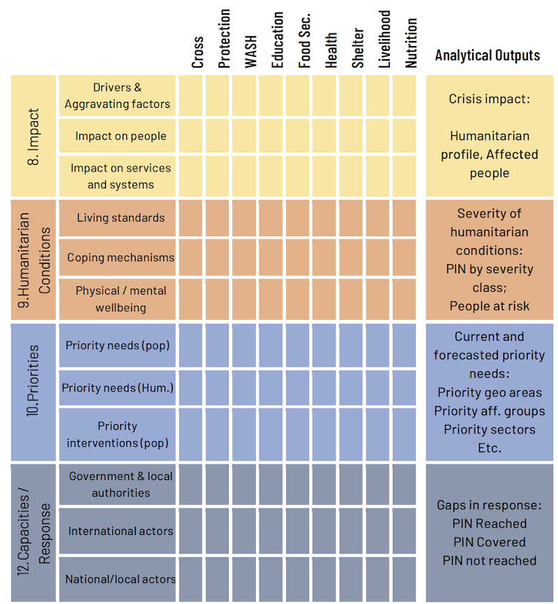

# Welcome

The DEEP project provides effective solutions to analyze and harvest data from secondary sources such as news articles, social media, and reports that are used by responders and analysts in humanitarian crises. During crises, rapidly identifying important information from the constantly-increasing data is crucial to understand the needs of affected populations and to improve evidence-based decision making. The DEEP has been used by many organisations in multiple crisis contexts, such as:
* The [monitoring of the impact of cyclone Idai and Kenneht in Mozambique, Malawi and Zimbabwe](https://media.ifrc.org/wp-content/uploads/sites/5/2019/07/201907-MOZ-MovementHandOut.pdf) by the Red Cross and Red Crescent Movement
* The [UNHCR Coordination Platform](https://r4v.info/en/situations/platform) for Refugees and Migrants from Venezuela
* The ACAPS secondary data review of the Rohingya influx in Bangladesh
* The [IMMAP/DFS Situation Analysis of the impacts of COVID in Syria](https://reliefweb.int/report/syrian-arab-republic/syria-immapdfs-covid-19-situation-analysis-january-2021)

Data Friendly Space is hosting this challenge to explore how the latest advances in Natural Language Processing can benefit the DEEP and enhance its user experience when it comes to tagging large amounts of unstructured information. DFS encourages anyone who is interested in advancing the applications of NLP and Machine Learning in the humanitarian sector to take part in this challenge, as the benefits would be immediately seen in helping to increase the quality of the humanitarian community’s secondary data analysis. As such, humanitarian analysts would be able to spend time doing what the human mind does best: subjective analysis of information.

## Who is Data Friendly Space?

Data Friendly Space (DFS) is a non-profit organization based in the United States with a global presence. DFS’ guiding principle is to improve information management and analysis capacity, tools and processes in the humanitarian and development community to enable better informed and more targeted assistance.

DFS staff is composed of experts from the humanitarian information management and analysis field who specialize in real time secondary data review and build humanitarian applications that support fast extraction of information from large volumes of unstructured data.

DFS also focuses on creation of data centric web applications, websites and mobile applications to support humanitarian organizations. When building software, DFS focuses on the intersection between data automation processes powered by Artificial Intelligences and human knowledge and skills, in particular when one can help the other to execute analysis. More information on Data Friendly Space and its projects can be found [here](https://datafriendlyspace.org/).

### Product: DEEP Platform

DFS is the technical host of the Data Entry and Exploration Platform (DEEP, [thedeep.io](https://www.thedeep.io/)), a tool used by humanitarians all over the world to monitor and assess crises. Over the past 4 years, humanitarian information analysts have been using the DEEP to facilitate collaborative, and joint analysis of unstructured data. The aim of the platform is to provide insights from years of historical and in-crisis humanitarian text data. The platform allows users to upload documents and classify text snippets according to predefined humanitarian target labels, grouped into and referred to as analytical frameworks. Tagging this data leads to the structuring of large volumes of information that enables effective analysis of the humanitarian conditions of the populations of interest and empowers humanitarians to identify information gaps and to provide sound recommendations in terms of needs assessment strategies and response plans. DEEP supports global operations of a range of international humanitarian organizations and the United Nations.

More information on the DEEP and how it is being used can be found here:
*	[DEEP Website](https://www.thedeep.io/)
*	[DEEP YouTube channel](https://www.youtube.com/channel/UCO3naDryeQIFny6BsEJwCaA)
*	[IFRC tutorial for conducting Needs Assessments with DEEP](https://deephelp.zendesk.com/hc/en-us/articles/360041904812-4-DEEP-Using-the-DEEP-Platform-)

As an example project, In 2020 DFS partnered with IMMAP, an international not-for-profit organization that provides information management services to humanitarian and development partners, in the COVID-19 Situational Analysis Project. The aim of the project is to provide the wider humanitarian community with timely and comprehensive information on the spread of the COVID-19 pandemic accross 6 countires: Syria, Bangladesh, Nigeria, the Democratic Republic of the Congo, Burkina-Faso and Colombia. More information on the project can be found [here](https://immap.org/news/covid-19-situational-analysis-project-in-six-countries/).

### How NLP can help in humanitarian crises?

The day-to-day workload of DEEP is mainly based on manual tagging of the experts, especialized in the humanitarian domain. The experts have extensive domain knowledge to understand how to use the analytical framework with its different taxonomies in order to assign the right labels to the right text snippets. Below, you can see the interface of the DFS/IMMAP analytical framework, where the experts are asked to assign approperiate classes to a selected snippet of text.

This process of selecting informative text excerpts from documents, and assigning approperiate tags is highly laborious and time consuming, while time is a decicive factor during humanitarian crises. The innovation of the DEEP relies upon leveraging recent advances in NLP to automate this process to assist experts to do what they are best at. 

# CHEERS Challenge

## Round 1: Extraction and Classification of Humanitarian Data

Participants are asked to build build the following:
  1. A **sentence extraction model** that predicts whether a sentence in a given document is **relevant** and belongs in the Secotral Information matrix or not
  2. A **classifier** that will predict the sector of a sentence that belongs in the Secotral Information matric

### Dataset

The primary data for the challenge is, in each provided `sentences_<split>_en.csv` file, the `sentence_text` column. This contains the text of analyzed documents after they have been split into sentences. Each sentence is classified, by data analysts, as relevant or irrelevant (0 or 1 in the `is_relevant` column). If a sentence is marked as relevant (i.e. `is_relevant` column is 1) the `sector_ids` column *may* contain a list of sector ids that this sentence belongs to. Otherwise, the `sector_ids` column is an empty list. The label columns (`is_relevant` and `sector_ids` columns) are provided only for the train and validation splits of the data. Each sentence is uniquely identified by its document id (`doc_id`) and sentence id (`sentence_id`) together.
We also provide the text of the original documents before splitting them into sentences. Participant are free to use the train and validation documents for any type of training they want. However, it is not allowed to use the test sentences or documents for any kind of training.
The train/validation/test sets’ are all in English in this round. More languages are coming in future rounds.
The structure of the provided data is as follows.

    DFS_CHEERS_Challenge/
      en/
        documents_train_en.csv
        documents_val_en.csv
        documents_test_en.csv
        sentences_train_en.csv
        sentences_val_en.csv
        sentences_test_en.csv

We will upload our data to the challenge Github page and provide its link here.

#### Columns of sentences*.csv
- `doc_id`: The identifier of the sentence source document.
- `sentence_id`: Combined with the corresponding `doc_id`, together they form unique ids for the sentences. Note that values of this column alone are not unique across the dataset.
- `sentence_text`: Text of the sentence.
- `is_relevant`: Determines whether the sentence is relevant (1) or not (0).
- `sector_ids`: A list of sector ids that this sentence belongs to. If the sector is not specified, the list is empty. Note that a sentence maybe relevant (i.e. `is_relevant` equals 1) but have an empty `sector_ids` list.

#### Columns of documents*.csv
- `project_name`: We have six projects in this dataset. They are: IMMAP/DFS Syria, Bangladesh, Nigeria, Burkina Faso, RDC, and Colombia.
- `country_code`: SYR for Syria, BGD for Bangladesh, NGA for Nigeria, BFA Burkina Faso, COD for RDC, and COL for Colombia.
- `doc_id`: A unique identifier for each document.
- `doc_text`: The textual content documents.
- `doc_url`: A url of source documents.

### Output and Evaluation
 
#### What Participants are Predicting?
For each sentence in the test split, the participants are asked to:
1. Predict the `is_relevant` variable value,
2. If `is_relevant` equals to 1, predict only one value from the possible `sector_ids` values. We ask participants to do that for the sake of simplicity.

#### Submission File
For each (`sentence_id`, `doc_id`) pair in the test set, you have to provide a 0/1 prediction for the `is_relevant` variable as well as only one label from possible `sector_ids`. For example, if the value of `sector_ids` of some sentence is `[1, 5]`, then participants can and should output `1` or `5`. The file should contain a header and have the following format:

    doc_id, sentence_id, is_relevant, sector_id
    0, 0, 0, -1
    0, 1, 1,  1
    0, 2, 0, -1
    1, 0, 1,  4
    2, 0, 1,  2
    2, 1, 1,  7
    2, 2, 1, -1
    2, 3, 1,  3
    2, 4, 0, -1

##### Constraints on the submission file:
- If a sentence has `is_relevant` equals to `0`, then its `sector_id` must be `-1`.
- If a sentence has `is_relevant` equals to `1`, then its `sector_id` must have a value other than `-1`.

#### Evaluation Metrics
Submissions are evaluated on [F1 Score](https://en.wikipedia.org/wiki/F-score#Definition) for the `is_relevant` variable, and on Accuracy or [Hamming Score](https://link.springer.com/chapter/10.1007/978-3-540-24775-3_5) for the `sector_ids` variable. Finally, to be able to sort the submissions in the leaderboard, we combine these two scores by formulating a new score called `HumImpact` which stands for *Humanitarian Impact*. `HumImpact` is calculated as: `HumImpact = 0.5*F1_score + 0.5*Accuracy`.

Please note the following about the way we calculate Hamming Score that are done for simplifying this challenge round.
1. Hamming Score is only calculated for sentences with `is_relevant` *predicted* as `1`.
2. Sentences with ground truth values of `[]` for the `sector_ids` variable, but the participant predicts other than `-1` will not be penalized.
3. Because participants are asked to predict only one label from the possible labels for `sector_ids`, the submssions are always penalized for setneces with multiple labels. For example, if a sentence has a value for `sector_ids` of `[2, 4]` and the participant predicts `2` then the accuracy of this example will be `1/2`.

#### Evaluation Script
The submissions will be evaluated using this [script](https://github.com/the-deep/NLP-Challenge/blob/main/eval.py).

### Results on Leaderboard
coming soon...!

# Terms and Conditions

The provided datasets are intended for non-commercial research purposes to promote advancement in the field of natural language processing, information retrieval and related areas in the humanitarian sector, and are made available free of charge without extending any license or other intellectual property rights. In particular:

* Any parts of the datasets cannot be publicly shared or hosted (with exception for aggregated findings and visualizations);
* The datasets can only be used for non-commercial research purposes; Upon violation of any of these terms, your rights to use the dataset will end automatically. The datasets are provided “as is” without warranty. The side granting access to the datasets is not liable for any damages related to use of the dataset.

### Contact

If you have any questions regarding technical aspects of the dataset, or how to obtain it, please contact us:
* Jean-Baptiste Bove (Innovation Lead): [email](mailto:jean@datafriendlyspace.org)
* Abdullah Al Nahas (R&D): [email](mailto:abdullah@datafriendlyspace.org)
* Navid Rekab-Saz (Academic Advisor): [webpage](http://navid-rekabsaz.com/)

[comment]: 
